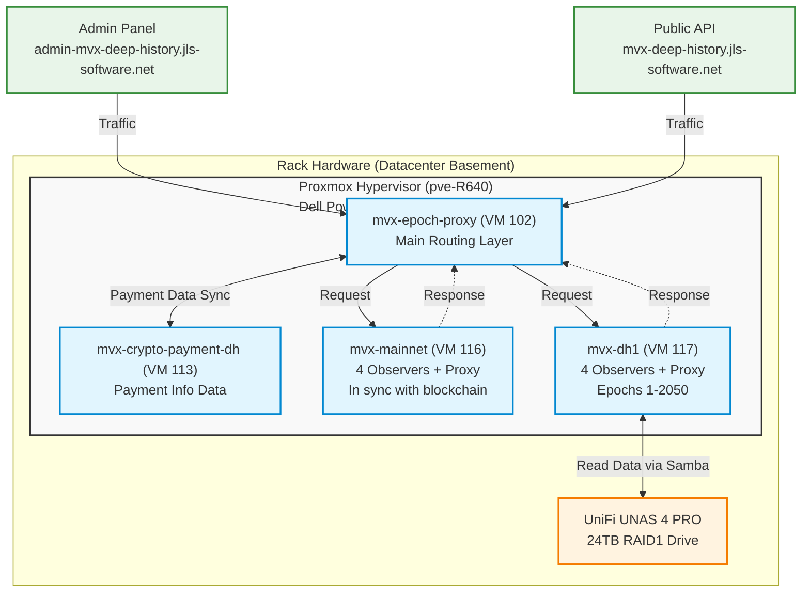

# MultiversX Epoch Proxy - Infrastructure & Dataflow

This document describes the hardware and software architecture of the Epoch Proxy infrastructure, designed to serve both live and historical (deep history) blockchain data efficiently.

## Overall Architecture

The system consists of a proxy layer that intelligently routes requests either to a live blockchain node (for recent data) or a deep-history node (for older epochs). It integrates a crypto payment service to handle access rights and limits.

### Architecture Diagram

## Hardware Infrastructure

The physical infrastructure is hosted in a dedicated rack in the **Basement Datacenter**.

1. **Hypervisor Host (Compute)**: 
   - **Dell PowerEdge R640**: High-density 1U server acting as the main compute node.
   - Runs **Proxmox Virtual Environment** (hostname: `pve-R640`).
2. **Network Attached Storage (Data)**:
   - **UniFi UNAS 4 PRO**: Provides high-capacity network storage.
   - Configured with a **24TB RAID1** drive array for redundancy.
   - Exposes Samba shares for accessing the massive historical blockchain data.
3. **Networking**: The rack is equipped with UniFi routing and switching equipment for high-throughput local connectivity.

## Virtual Machine Infrastructure

Inside the Proxmox environment (`pve-R640`), several targeted VMs are provisioned to handle distinct parts of the service workload.

### 1. `mvx-epoch-proxy` (VM 102)
- **Role**: Core ingress point and intelligent routing service.
- **Function**: Receives external requests from `mvx-deep-history.jls-software.net` and `admin-mvx-deep-history.jls-software.net`. Based on the requested epoch or data block, it forwards the request to either the live mainnet node or the deep history node.
- **Integration**: Communicates bi-directionally with the `mvx-crypto-payment-dh` VM to validate and record payment info.

### 2. `mvx-crypto-payment-dh` (VM 113)
- **Role**: Payment processor and manager.
- **Function**: Handles the crypto payment infrastructure, ensuring users have active access/balances to query the deep history infrastructure.
- **Dataflow**: Syncs payment info data directly with the Epoch Proxy VM.

### 3. `mvx-mainnet` (VM 116)
- **Role**: Live network node.
- **Function**: Runs a MultiversX Mainnet environment comprising **4 observers + proxy**.
- **State**: Kept fully in sync with the tip of the live blockchain.
- **Dataflow**: Responds to queries routed from the Epoch Proxy for recent/current epochs.

### 4. `mvx-dh1` (VM 117)
- **Role**: Deep History node.
- **Function**: Runs 4 observers + proxy specifically configured for historical data archiving and retrieval. Currently serves **epochs 1 through 2050**.
- **Storage**: Due to the massive storage footprint of historical epochs, this VM retrieves its state from the local UniFi UNAS appliance via a **Samba share**, preventing the primary VM SSDs from becoming saturated.

---

## Networking & Domains

The Epoch Proxy exposes two external endpoints to interact with the underlying virtual machines:

- **Client Access**: `mvx-deep-history.jls-software.net`
- **Administrative Access**: `admin-mvx-deep-history.jls-software.net`

Requests hitting these URLs are appropriately terminated by the `mvx-epoch-proxy` VM, which serves as the protective and routing proxy over the internal ecosystem.
