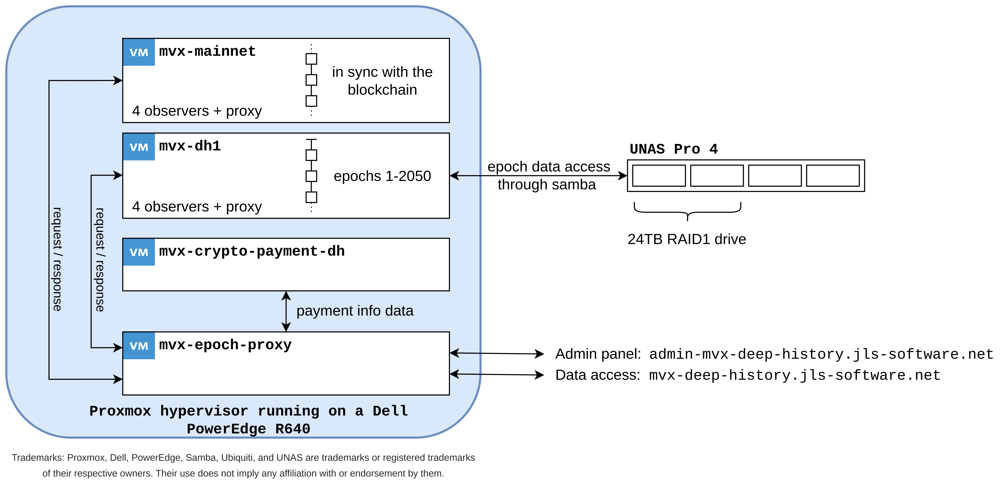

# MultiversX Epoch Proxy - Infrastructure & Dataflow

This document describes the hardware and software architecture of the Epoch Proxy infrastructure, designed to serve both live and historical (deep history) blockchain data efficiently.

## Overall Architecture

The system consists of a proxy layer that intelligently routes requests either to a live blockchain node (for recent data) or a deep-history node (for older epochs). It integrates a crypto payment service to handle access rights and limits.

### Architecture Diagram

## Hardware Infrastructure

The physical infrastructure is hosted in a dedicated rack equipped with redundant power supplies and high-speed networking.

1. **Hypervisor Host (Compute)**: 
   - **Dell PowerEdge R640**: High-density 1U server acting as the main compute node.
   - Runs **Proxmox Virtual Environment**.
2. **Network Attached Storage (Data)**:
   - **UniFi UNAS PRO 4**: Provides high-capacity network storage.
   - Configured with a **24TB RAID1** drive array for redundancy.
   - Exposes Samba shares for accessing the massive historical blockchain data.
3. **Networking**: The rack is equipped with UniFi routing and switching equipment for high-throughput local connectivity.

## Virtual Machine Infrastructure

Inside the Proxmox environment (`pve-R640`), several targeted VMs are provisioned to handle distinct parts of the service workload.

### 1. `mvx-epoch-proxy`
- **Role**: Core ingress point and intelligent routing service.
- **Function**: Receives external requests from `mvx-deep-history.jls-software.net` and `admin-mvx-deep-history.jls-software.net`. Based on the requested epoch or data block, it forwards the request to either the live mainnet node or the deep history node.
- **Integration**: Communicates bi-directionally with the `mvx-crypto-payment-dh` VM to validate and record payment info.
- **VM specs**: 4 CPUs, 8GB RAM, 20GB disk.

### 2. `mvx-crypto-payment-dh`
- **Role**: Payment processor and manager.
- **Function**: Handles the crypto payment infrastructure, ensuring users have active access/balances to query the deep history infrastructure.
- **Dataflow**: Syncs payment info data directly with the Epoch Proxy VM.
- **VM specs**: 4 CPUs, 4GB RAM, 20GB disk.

### 3. `mvx-mainnet`
- **Role**: Live network node.
- **Function**: Runs a MultiversX Mainnet environment comprising **4 observers + proxy**.
- **State**: Kept fully in sync with the tip of the live blockchain.
- **Dataflow**: Responds to queries routed from the Epoch Proxy for recent/current epochs.
- **VM specs**: 20 CPUs, 64GB RAM, 12TB disk.

### 4. `mvx-dh1`
- **Role**: Archive node for historical epochs between 1 and 2050.
- **Function**: Runs 4 observers + proxy specifically configured for historical data archiving and retrieval. 
- **Storage**: Due to the massive storage footprint of historical epochs, this VM retrieves its state from the local UniFi UNAS appliance via a **Samba share**, preventing the primary VM SSDs from becoming saturated.
- **VM specs**: 16 CPUs, 64GB RAM, 400GB disk + 24TB NAS shared storage.

## Software solutions

### 1. `mvx-epoch-proxy`
- **URL**: https://github.com/iulianpascalau/mx-epoch-proxy-go
- **Language**: Go, Typescript, HTML, CSS, JavaScript, Shell
- **Purpose**: Main entry point, accessible from the internet. It manages the data access through tokens, integrates the crypto payment service and performs the data serving, intelligently routing the requests on the available and configured data nodes.
- **Local DB**: Yes, SQLite3.

### 2. `mvx-crypto-payment-dh`
- **URLs**: https://github.com/iulianpascalau/mx-crypto-payments-go, https://github.com/iulianpascalau/mx-credits-contract-rs
- **Language**: Go, Shell, Rust
- **Purpose**: Service that manages crypto payments providing access to dedicated accounts for each new user through private/public keys derived from a seed phrase. Handles contract interactions using the MultiversX relayed transactions v3.
- **Local DB**: Yes, SQLite3.

### 3. `mvx-mainnet`
- **URLs**: https://github.com/multiversx/mx-chain-go, https://github.com/multiversx/mx-chain-mainnet-config, https://github.com/multiversx/mx-chain-scripts
- **Language**: Go, Shell
- **Purpose**: Official MultiversX Mainnet node code, configuration files and scripts.
- **Local DB**: Yes, LevelDB.

### 4. `mvx-dh1`
- **URLs**: https://github.com/iulianpascalau/mx-chain-deep-history-go, https://github.com/multiversx/mx-chain-mainnet-config, https://github.com/iulianpascalau/mx-chain-deep-history-scripts
- **Language**: Go, Shell
- **Purpose**: Altered node code and scripts repositories, specifically designed for historical data retrieval. The node code is tuned so only the API engine is running, the p2p, blocks syncing, heartbeat and consensus go routines are not started to conserve resources.
- **Local DB**: Yes, LevelDB.

## Crypto Payment Service

A detailed diagram of the crypto payment is presented below:

The process starts with the user that wishes to buy credits (tokens) to be used for accessing the Deep History infrastructure. In the administration panel, when accessing the crypto-payments section, a new, unique ID will be allocated for that user. 
Based on the ID, also a private/public key pair will be generated that will be handled by the crypto-payments service. If any MultiversX wallet deposits EGLD funds on that generated address, and the amount exceeds the minimum deposit amount, 
a loop inside the crypto-payments service will detect this event and will automatically call the `addCredits` smart-contract function using a relayer. In this way we can ensure that absolutely all transferred funds from the user will be converted to credits.
And also, greatly simplify the process from the user's perspective as it won't require that the user perform complex tasks. Only one simple transfer funds operation.

**_Note:_** This service can be used in other systems and contexts as a separate building block. It does the lifting part of the conversion between EGLD to tokens or credits used to perform some specific tasks.

## Networking & Domains

The Epoch Proxy exposes two external endpoints to interact with the underlying virtual machines:

- **Client Access**: `mvx-deep-history.jls-software.net`
- **Administrative Access**: `admin-mvx-deep-history.jls-software.net`

Requests hitting these URLs are appropriately terminated by the `mvx-epoch-proxy` VM, which serves as the protective and routing proxy over the internal ecosystem.

## Performance Metrics

- **Epochs 1 to 2050 (Historical Data)**: Expect response times of ~1 second per request. If multiple requests are bundled targeting the same epochs, response times can drop as low as 250ms.
- **Epochs 2051 to Present (Live Data)**: Response times typically range from 35-200ms per request.

The higher latency for older epochs (1–2050) occurs because the massive dataset is housed on mechanical hard drives (HDDs), where physical read speeds are limited to roughly 40-50MB/s. Additionally, the node's underlying LevelDB database relies on an incredibly large number of small files (~2MB each), which induces significant disk seek overhead. Once high-capacity SSDs become economically feasible at a 24TB scale, they will replace the current mechanical array natively. Until then, response times for deep history queries will remain at these expected levels.

---

## Infrastructure Evolution

### 1. Initial Solution (November 2024)
The initial configuration consisted of: 
- 1 physical server running the official mainnet node (epochs 1543 onwards).
- 1 physical server running the deep history node version (epochs 953 to 1543).
- 1 physical server running the deep history node version (epochs 1 to 953).
- 1 VM running the initial Epoch Proxy application (v1.0.1).

**This solution ran on three servers with local SSD storage. While data access was exceptionally fast, the deployment model proved unsustainable due to the high hardware cost of adding a dedicated server for roughly every year's worth of historical data.** 
The system was heavily utilized by the MultiversX team and was also made publicly accessible via a community solution developed by the Buidly team. To raise ecosystem awareness, the Buidly team published comprehensive Medium articles alongside Telegram and Twitter announcements.

### 2. v1.0.x & v1.1.x (2025)
The hardware configuration remained unchanged, but the Epoch Proxy software was updated to accommodate manually whitelisted tokens, granting access to select users outside of the MultiversX team. 

During runtime monitoring in 2025, disk space usage became the primary bottleneck. Following infrastructure evaluations with the MultiversX team, a decision was made to shift from server-hosted local storage toward a more sustainable Network Attached Storage (NAS) approach. The hardware upgrade was temporarily postponed until the chosen NAS (UniFi UNAS PRO 4) became available.

### 3. v1.2.x (January 2026)
While awaiting hardware availability, the Epoch Proxy solution was re-evaluated, and a fully functional administrative panel was developed. This phase included significant frontend development, database integration, and configuration refinements.

### 4. v1.3.x (January 2026)
Development began on the crypto payment service as a means to automate the migration of users from free-tier to premium-tier access based on active on-chain subscriptions.

### 5. v1.4.x (February 2026)
To increase solution modularity and reusability, the entire codebase was heavily refactored. The `epoch-proxy`, `crypto-payment`, and `credits-contract` components were split into distinct, dedicated repositories.

### 6. Hardware Refactoring (February – April 2026)
With the UniFi NAS hardware finally available, the primary challenge of disk space was addressed. The massive volume of historical data was gradually migrated over a prolonged period. Once the data copying was complete—utilizing nearly the entire 24TB capability of the UNAS drive—the following infrastructure optimizations took place:
- The physical servers previously hosting historical data locally were decommissioned and repurposed.
- The physical server running the official mainnet node (Dell R640) was wiped and re-provisioned to host the new Proxmox hypervisor (`pve-R640`).
- Two dedicated VMs were added to the hypervisor: one for the live official mainnet node, and one for the deep history node (which reads large archived epochs from the UNAS over a Samba share).
- The VMs running the crypto payment service and the Epoch Proxy were also migrated onto this consolidated Proxmox server, finalizing the current architecture.
